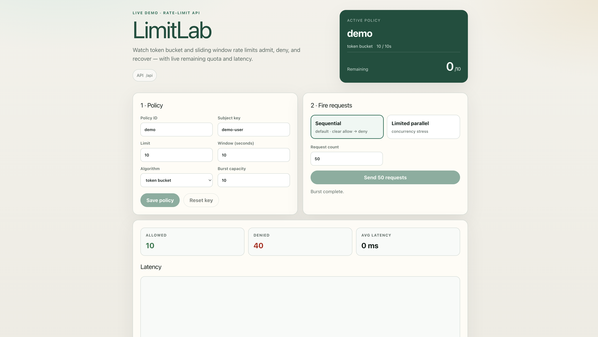
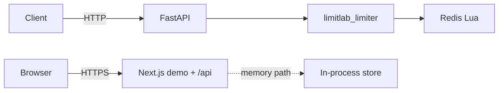

# LimitLab

[](https://github.com/tanmays0/limitlab/actions/workflows/ci.yml)
[](https://limitlab.vercel.app)
[](./loadtests/reports/k6-report.html)
[](./LICENSE)

High-performance rate-limiting platform: **token bucket** + **sliding window**,
atomic **Redis Lua** enforcement, Prometheus metrics, and a live demo dashboard.

**Live demo:** https://limitlab.vercel.app



## Stack

| Layer | Tech |
|-------|------|
| API | FastAPI, uvicorn, pydantic |
| Limiter | Redis Lua (token bucket, sliding window) |
| Demo | Next.js 15, TypeScript |
| Proof | k6 (~7,955 RPS local), `/metrics` |
| Deploy | Vercel (demo), Fly/Render configs |

## Architecture



| Path | Use |
|------|-----|
| Demo `/api` | Public Vercel demo (in-memory + `/v1/burst`) |
| FastAPI + Redis | Local bench / multi-instance correctness |

## Features

- Per-policy algorithm: token bucket or sliding window
- Atomic admit/deny via Redis Lua (no over-admit under concurrency)
- Standard headers: `X-RateLimit-*`, `Retry-After`
- `REDIS_FAILURE_MODE=fail_closed` (default) or `fail_open`
- Live UI: policy editor, sequential/parallel burst, remaining quota, latency
- Load-test artifacts committed under `loadtests/reports/`

## Monorepo

```text
apps/api          FastAPI service
apps/web          Next.js demo + /api routes
packages/limiter  Algorithms, Redis Lua, memory store
loadtests         k6 scripts + reports
specs/            Design docs
```

## Quick start

### Demo UI

```bash
cd apps/web && npm install && npm run dev
```

Open http://127.0.0.1:3000

### FastAPI + Redis

```bash
cp .env.example .env
docker run -d --rm --name limitlab-redis -p 6379:6379 redis:7-alpine

python3 -m venv .venv && source .venv/bin/activate
pip install -e "packages/limiter[dev]" -e "apps/api[dev]"
cd apps/api
REDIS_URL=redis://localhost:6379/0 PYTHONPATH=. \
  uvicorn app.main:app --host 127.0.0.1 --port 8080 --workers 4
```

```bash
cd apps/web
echo 'NEXT_PUBLIC_API_URL=http://127.0.0.1:8080' > .env.local
npm install && npm run dev
```

```bash
curl http://127.0.0.1:8080/health
curl 'http://127.0.0.1:8080/metrics?format=json'
```

## API

| Method | Path | Description |
|--------|------|-------------|
| POST | `/v1/check` | Peek allow/deny |
| POST | `/v1/consume` | Consume quota |
| POST | `/v1/burst` | Upsert policy + N consumes |
| POST | `/v1/reset` | Clear subject quota |
| GET/PUT | `/v1/policies/{id}` | Read / upsert policy |
| GET | `/health` | Liveness |
| GET | `/metrics` | Prometheus (`?format=json`) |

Public demo paths are under `/api`.

## Load test

| Metric | Result |
|--------|--------|
| RPS | ≈ **7,955** |
| p95 | ≈ 40 ms |
| Hardware | Apple M5 · Redis Docker · 4 workers · 200 VUs · 30s |

[Reproduce](./loadtests/README.md) · [HTML report](./loadtests/reports/k6-report.html) · [JSON summary](./loadtests/reports/k6-summary.json)

## Tests

```bash
source .venv/bin/activate
pytest packages/limiter apps/api -q
```

CI runs the same suite on every push to `main`.

## Deploy

| Surface | Target |
|---------|--------|
| Demo UI + `/api` | [limitlab.vercel.app](https://limitlab.vercel.app) |
| Redis API | [fly.toml](./fly.toml), [render.yaml](./render.yaml) |

Details: [DEPLOY.md](./DEPLOY.md)

## Spec

[specs/001-rate-limiter-platform/](./specs/001-rate-limiter-platform/)

## License

[MIT](./LICENSE)
